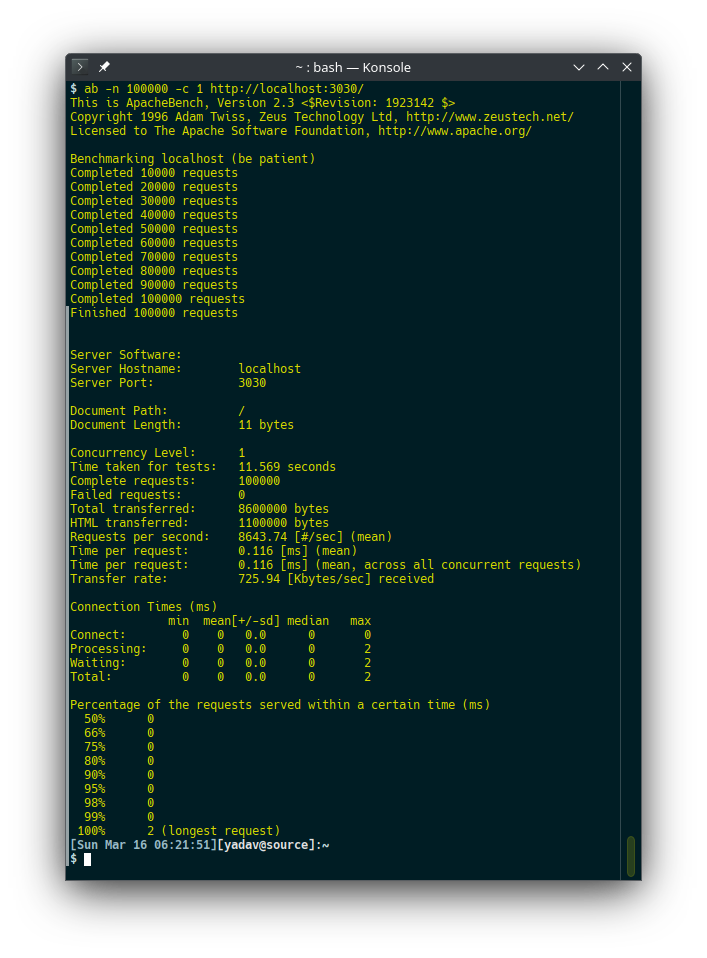

# FURI - Fast Uniform Resource Identifier


## A Return to Simplicity ✅

FURI is a Node.js framework coded in TypeScript. If you love TypeScript, you will feel at home coding with FURI. If you love plain JavaScript, you will love coding in FURI, you get to decide.

The design has been kept as close to the Node.js API without using external dependencies, using modern JavaScript and the latest Node.js APIs.

 The Router was coded from the ground up in TypeScript, it is the core of the framework, with a blazing fast lookup and matching algorithm.

Zero useless abstraction, simple clean coding, designed for hardware with small resources. Perfect for micro-architecture. Very little between your code and the Node.js API to minimize performance overhead.

Router has been battle tested with unit tests and functional tests.

A self contained design and zero external dependencies means there is  less surface area for bugs and security issues to hide and creep in. There is less likelihood for working code to break after pulling in updates. Having to maintain perfect working code broken due to an update is an anti-pattern and an insane mindset to develop software.

FURI will keep simple things simple and make hard things easier without breaking your working code. It is however still in the early preview stage so expect changes as I explore design ideas.

### BOM - Bill of Material

The following tools, technologies and software was used in the development of FURI (v0.1.4).

Item | Version | Description
--- | --- | ---
TypeScript | 5.7.3 | A super-set of JavaScript that adds static typing and other features to the language.
yaml | 2.7.0 | A library for parsing YAML used to read FURI configuration file.
@deno/dnt | 0.41.3 | A tool for building NPM packages.
@std/assert | 1.0.11 | Deno standard library for assertions, used in test code.
Deno | 2.2.1 | A runtime environment for JavaScript that aims to be secure and fast.
Node.js | 20.18.3 LTS | The runtime environment for JavaScript.
Linux | 6.13.1-1-default | openSUSE Tumbleweed with KDE desktop

__NOTE__: See Changelog for additional details on changes and updates. ✅

### Coding with JavaScript

__File: "main.js"__

```ts
import { Furi } from '@furi-server/furi';
const furi = Furi.create();

furi.get('/', (ctx) => {
    return { message: 'Hello World' };
});

furi.start();
```

### Coding with TypeScript

You can use TypeScript with Node.js, but you will need to compile the TypeScript code to JavaScript before running it with Node.js.

With Deno it is simpler, as it will run the TypeScript code without needing a separate compile step.

__File: "main.ts"__

```ts
import { Furi, ApplicationContext } from '@furi-server/furi';
const furi = Furi.create();

furi.get('/', (ctx: ApplicationContext) => {
    return { message: 'Hello World' };
});

furi.start();
```

### Using NPM and Node.js

To install the NPM package, use:

```sh
npm install @furi-server/furi
```

### Using Deno

If you are using Deno, add the package with:

```sh
deno add npm:@furi-server/furi
```

## Array based routing

FURI now supports array based routes.

Here is an example of a route with an inline lambda handler:

```ts
import { Furi } from '@furi-server/furi';
const furi = Furi.create();

const routes: Routes = {
  routes: [
    {
      method: 'get',
      path: '/one',
      controller: (ctx: ApplicationContext, next) => {
        ctx.response.writeHead(200, {
          'Content-Type': 'text/html',
          'User-Agent': USER_AGENT
        });
        ctx.end('Middleware Pre!\n');
      }
    }
  ]
}

furi.use(routes);
```

You can also mount the array route on a path:

```ts
furi.use('/v1/api', routes);
```

You can also mount the array on a router and then mount that to the app:

```ts
const router = Furi.router();
router.use(routes);

furi.use('/admin',router);
```

__NOTE__: Top-level middlewares, even when mounted to a router, that are then mounted to the route-path will always remain top-level middlewares.

### Declaring a Handler Class

To declare the class based handler, you will need to:

1. Subclass "__BaseRouterHandler__".
2. Override the "handle" method.

__NOTE__: You can also declare a class based middleware, the handler function will also need to accept the "__next__" argument.

```ts
class HelloWordHandler extends BaseRouterHandler {

   override handle(ctx: ApplicationContext): any {
        ctx.response.writeHead(200, {
            'Content-Type': 'text/plain',
            'User-Agent': USER_AGENT
        });
        // ctx.end('HelloWordHandler\n');
        return 'HelloWordHandler\n';
    }
}
```

In the route array, you simply pass the class name to the controller property:

```ts
const routes: Routes = {
  routes: [
    {
      method: 'get',
      path: '/helloworld',
      controller: HelloWordMiddlewareHandler
    }
  ]
};

const router = Furi.router();
router.use(routes);
```

### Declaring top-level middleware

Remember will middleware, from the handler function you will need to call "next()" to pass control to the next middleware or handler.

```ts
function myMiddleware(ctx: ApplicationContext, next) {
  ctx.response.writeHead(200, {
    'Content-Type': 'text/html',
    'User-Agent': USER_AGENT
  });
  ctx.send('Middleware Pre!\n');
  next();
}
```

In the router array, the top-level middlewares are declared in the middleware array:

```ts
const routes: Routes = {
  middleware: [
    myMiddleware
  ],
  routes: [
    ...
  ]
};
```

### Declaring route-level middleware

As with the function based routes, you can also declare route-level middleware in route array:

```ts
const routes: Routes = {
  routes: [
    {
      method: 'get',
      path: '/one',
      controller: (ctx: ApplicationContext, next) => {
        ctx.response.writeHead(200, {
          'Content-Type': 'text/html',
          'User-Agent': USER_AGENT
        });
        ctx.send('Middleware Pre!\n');
        next();
      }
    },
    {
      method: 'get',
      path: '/one',
      controller: (ctx: ApplicationContext, next) => {
        ctx.response.writeHead(200, {
          'Content-Type': 'text/html',
          'User-Agent': USER_AGENT
        });
        ctx.end('Hello World!\n');
      }
    },
  ]
};
```

### Configuration file

FURI lets you configure server settings from a YAML file. This allows you to easily change settings without having to modify your code.

__File: "furi.yaml" (optional)__

```yaml
server:
  port: 3030
  host: localhost
  env: development
```

FURI is currently under development. However it is feature complete with respect to the Router, and today could be put into production use. Current development effort is focused on adding support for a easy to use State management store for seamless data access. Persistence using SQLite3 as the default database engine, with a plug-in architecture for other DB engines.

## Super fast stream logging ⚡

FURI supports fist-class logging at the code. Logging is fast and takes place on a background worker-thread, so the main thread never blocks. Logging can be buffered, or immediately written to file. Logging behavior can be configured in FURI's configuration YAML file.

Logging uses the latest Node.js features. Since logging is the core functionality of FURI, there is very little code overhead compared to existing logging libraries.

### Logger configuration

Here are the configurable logging options:

- flushPeriod: Control time to flush buffered log messages.
- maxCount: Maximum number of log messages before flushing.
- mode: Can be one of "stream" or "buffered".

- level: Can be one of "debug", "info", "log", "warn", "error", "critical" or "fatal".

The level is used to filter log messages based on their severity. Only messages at or above the configured level will be logged.

```yaml
logger:
  enabled: true
  flushPeriod: 1000
  logFile: furi.log
  maxCount: 100
  mode: stream
  level: info
```

### Log levels

It is suggested for Users application code, you log at the "log" level. The framework logs at the "info" level, to provide additional information on the request. However should you ever want to limit logging to your own  application code while developing, it will help reduce the log noise.

The following log levels are supported, list in increasing order of severity:

Level | Description
------|-------------
debug | Verbose output for debugging purposes.
info  | Default log, details operations information.
log | General User application level logging.
warn | State that is not a normal operation.
error | Application level error needing investigation.
critical | System level error that may cause application to fail.
fatal | Unrecoverable error causing application to terminate.

### Sample log output

```txt
2025-03-01T18:31:34.979Z, INFO, FURI Server (v0.2.0) started { host: 'localhost', port: 3030, mode: 'development' }
2025-03-01T18:31:37.842Z, INFO, host: localhost:3030, remote-ip: 127.0.0.1, remote-port: 38684, http: 1.1, method: GET, url: /
2025-03-01T18:31:37.855Z, INFO, host: localhost:3030, remote-ip: 127.0.0.1, remote-port: 38694, http: 1.1, method: GET, url: /
2025-03-01T18:31:37.856Z, INFO, host: localhost:3030, remote-ip: 127.0.0.1, remote-port: 38696, http: 1.1, method: GET, url: /about
2025-03-01T18:31:37.858Z, INFO, host: localhost:3030, remote-ip: 127.0.0.1, remote-port: 38706, http: 1.1, method: GET, url: /about/
2025-03-01T18:31:37.859Z, INFO, host: localhost:3030, remote-ip: 127.0.0.1, remote-port: 38710, http: 1.1, method: GET, url: /about/raj12
```

## Motivation


The primary objective of the FURI project is to provide a fast, small HTTP server that runs on small hardware with low memory. This benefits micro-architect environments with scaling and performance, with faster load time, compact footprint to maximize bigger production workloads.

The guiding principle of the project is to have the code base self contain with no external dependencies. This allows for easy deployment and maintenance on any platform that supports Node.js. The aim is for small independent shops to be able to run a production server and website while keeping the cost down substantially, along with the effort to maintain the setup.

## Why

A fast, responsive and lightweight framework that is easy to use. FURI keeps your code simple, avoids useless abstraction and does not get in the way with working with Node.js core APIs should you ever need to.

Inspired by Express.js and Koa.

## Benchmarks 🚀

FURI outperformed both Fastify and Express.js 5.0 in a benchmark test.
Below are the benchmarks results.

1. Number of requests made: 100,000
1. Total time taken in seconds.
1. Requests handled in 1 second.

| Framework | Requests | Total Time | Requests handled / sec  |
| - | - | - | - |
| FURI | 100,000 | 12.670 s | 7892.63 |
| Fastify | 100,000 | 14.486 s | 7124.84 |
| Express.js v5.0 | 100,000 | 13.882 s | 7203.31 |

### FURI Benchmark



### Fastify Benchmark


### Express Benchmark


